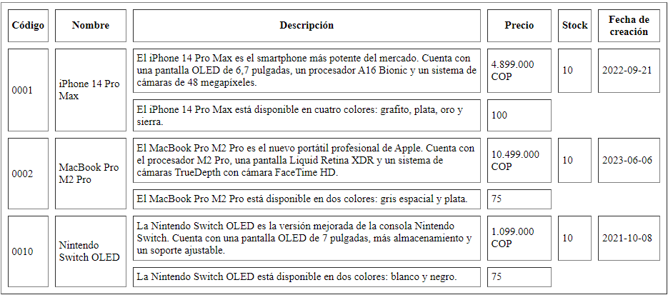

<!-- No borrar o modificar -->
[Inicio](./index.md)

## Sesión 3 


<!-- Su documentación aquí -->

# Actividad: Crear una tabla HTML con información sobre productos.
### Escribir una tabla HTML con 10 filas que muestre información sobre productos reales. La tabla debe tener las siguientes columnas:

- Código
- Nombre
- Descripción
- Precio
- Stock
- Fecha de creación
  
Además, combinar celdas en la tabla con los atributos rowspan y colspan, como se muestra en la siguiente imagen.

! [tabla]( )

_____
_____
## Solución

``````` html
<!DOCTYPE html>
<html lang="en">

<head>
    <meta charset="UTF-8">
    <meta name="viewport" content="width=device-width, initial-scale=1.0">
    <title>Document</title>
</head>

<body>
    <table border="5" align="5" cellpadding="10" cellspacing="10" valign="5">
        <thead>
            <tr>
                <th>Codigo</th>
                <th>Nombre</th>
                <th colspan="7">Descripcion</th>
                <th>Precio</th>
                <th>Stock</th>
                <th>Fecha De Creacion </th>
            </tr>
        </thead>
        </tbody>
        <tr>
            <td rowspan="2">001</td>
            <td rowspan="2">iphone 14 pro <br>Max</td>
            <td colspan="7">
                <p>El iphone 14 pro max es el smarphone mas potente del mercado. cuenta con una pantalla oled de 6,7
                    pulgadas.
                    <br>un procesador bionic y un sistema de camaras de 48 pixeles.
                </p>
            </td>
            <td>4.899.000 COP</td>
            <td>10</td>
            <td>2022-09-21</td>

        </tr>
        <tr>
            <td colspan="7">
                <p>El Iphone 14 Pro Max esta disponible en 4 colores: Grafito, plata, oro, y negro</p>
            </td>
            <td>100</td>
        </tr>
        <tr>
            <td rowspan="2">002</td>
            <td rowspan="2">Mac Book Proo <br> M2 Pro</td>
            <td colspan="7">
                <p>El Mac Book Pro M2 Pro es el nuevo portatil profesional de Apple. cuenta con el procesador M2 Pro,
                    una pantalla liquid Retina XDR y un sistema de camaras True Depth con camara Face Time HD.</p>
            </td>
            <td>10.499.000 COP</td>
            <td>10</td>
            <td>2023-06-06</td>
        </tr>
        <tr>
            <td colspan="7">
                <p> El Mac Book Pro M2 Pro esta disponible en dos colores: Gris espacial y Plata.</p>
            </td>
            <td>75</td>
        </tr>
        <tr>
            <td rowspan="2">003</td>
            <td rowspan="2">Nintendo <br> Swich OLED</td>
            <td colspan="7">
                <p>La Nintendo Swich OLED es la version mejorada de la consola Nintendo Swich. Cuenta con una
                    pantalla OLED de 7 pulgadas, mas almacenamiento y un soporte ajustable.</p>
            </td>
            <td>1.099.000 COP</td>
            <td>10</td>
            <td>2021-10-08</td>
        </tr>
        <tr>
            <td colspan="7">
                <p> La Nintendo Swich OLED esta disponible en dos colores: Blanco y Negro.</p>
            </td>
            <td>200</td>
        </tr>
        <tr>
            <td rowspan="2">004</td>
            <td rowspan="2">Apple Wach</td>
            <td colspan="7">
                <p>El Apple Watch, presentado por el fabricante como, es el primer reloj inteligente
                    creado por la empresa Apple, Fue reemplazado por el Apple Watch Series 1, Series 2, y otros que le
                    siguieron anualmente.</p>
            </td>
            <td>1.389.900 COP</td>
            <td>25.832</td>
            <td>2015-04-09</td>
        </tr>
        <tr>
            <td colspan="7">
                <p>Todas las cajas del Apple Watch están diseñadas para nadar y tienen un cristal frontal
                    resistente al polvo y a los golpes. </p>
            </td>
            <td>545</td>
        </tr>
        <tr>
            <td rowspan="2">005</td>
            <td rowspan="2">Xbox 360</td>
            <td colspan="7">
                <p>Xbox 360 es la segunda videoconsola de sobremesa de la marca Xbox producida por Microsoft. Fue
                    desarrollada en colaboración con IBM y ATI. permite a los jugadores competir en línea y descargar
                    contenidos como juegos arcade, demos, tráileres.</p>
            </td>
            <td>840.000 COP</td>
            <td>37.899</td>
            <td>2006-09-27</td>
        </tr>
        <tr>
            <td colspan="7">
                <p> El xbox 360 esta disponible en dos colores: Blanco y Negro.</p>
            </td>
            <td>95</td>
        </tr>
        <tr>
            <td rowspan="2">006</td>
            <td rowspan="2">Play Station 5</td>
            <td colspan="7">
                <p>es la quinta consola de videojuegos de sobremesa desarrollada por la empresa Sony Interactive
                    Entertainment. Fue anunciada en el año 2019 como la sucesora de la PlayStation 4. </p>
            </td>
            <td>2.799. 900 COP</td>
            <td>10 M.</td>
            <td>2020-11-12</td>
        </tr>
        <tr>
            <td colspan="7">
                <p> La Play Station 5 esta disponible en Colombia en lo siguientes colores: ‘Midnight Black’, ‘Cosmic
                    Red’, ‘Nova Pink’, ‘Starlight Blue’ y ‘Galactic Purple’.</p>
            </td>
            <td>70</td>
        </tr>
        <tr>
            <td rowspan="2">007</td>
            <td rowspan="2">Aspiradora robot</td>
            <td colspan="7">
                <p> cuenta con una programación inteligente y un limitado sistema de limpieza. El diseño original
                    incluía la operación manual a través del control remoto y un modo "auto-drive" que permitía a la
                    máquina limpiar de forma autónoma sin control humano. </p>
            </td>
            <td>1.169.940 COP</td>
            <td>14 M.</td>
            <td>2021-08-25</td>
        </tr>
        <tr>
            <td colspan="7">
                <p> Las Aspiradoras robot, cuentan con una amplia gama de colores.</p>
            </td>
            <td>87</td>
        </tr>
        <tr>
            <td rowspan="2">008</td>
            <td rowspan="2">Amazon Alexa</td>
            <td colspan="7">
                <p>Es un asistente virtual desarrollado por Amazon, utilizado por primera vez en el altavoz inteligente
                    Amazon Echo.stá disponible en inglés, alemán, japonés, francés, italiano y español. Alexa puede
                    controlar varios dispositivos inteligentes que sean compatibles con este sistema, como
                    focos, interfonos, cámaras de videovigilancia e interruptores inteligentes. </p>
            </td>
            <td> 323.800 COP</td>
            <td>7.8 M.</td>
            <td>2018-11-16</td>
        </tr>
        <tr>
            <td colspan="7">
                <p>Los dispositivos Amazon Alexa, muestran hasta siete colores: amarillo, azul, rojo, naranja, verde,
                    morado y blanco.</p>
            </td>
            <td>300</td>
        </tr>
        <tr>
            <td rowspan="2">009</td>
            <td rowspan="2">Impresora 3D</td>
            <td colspan="7">
                <p> Una impresora 3D es un aparato capaz de imprimir en tres dimensiones, sirve para imprimir objetos
                    que tienen volumen y de un material acorde al uso que vayamos a dar. utilizan el diseño asistido por
                    ordenador (CAD) para crear objetos 3D a partir de diversos materiales, como plástico fundido,
                    metales o polvos.</p>
            </td>
            <td> 2.227.297 COP</td>
            <td>7.8 M.</td>
            <td>1981-02-21</td>
        </tr>
        <tr>
            <td colspan="7">
                <p>Si bien la parte se crea capa por capa con PLA incoloro. la impresora 3D libera simultáneamente
                    tintas en colores cian, magenta, amarillo y negro</p>
            </td>
            <td>69</td>
        </tr>
        <tr>
            <td rowspan="2">010</td>
            <td rowspan="2">Tesla Roadster</td>
            <td colspan="7">
                <p>El Tesla Roadster fue uno de los primeros automóviles que comercializó la marca de Elon Musk. Es un
                    automóvil impresionante con unas prestaciones capaz de desbancar a cualquier superdeportivo del
                    mercado. </p>
            </td>
            <td> 690.000.000 COP</td>
            <td>5 U.</td>
            <td>2017-10-30</td>
        </tr>
        <tr>
            <td colspan="7">
                <p>Por el momento, solo hemos podido ver el nuevo Tesla Roadster en tres colores, el famoso color rojo
                    «Tesla», en un gris precioso y en blanco perlado, </p>
            </td>
            <td>650</td>
        </tr>

        </tbody>

</html>
`````
